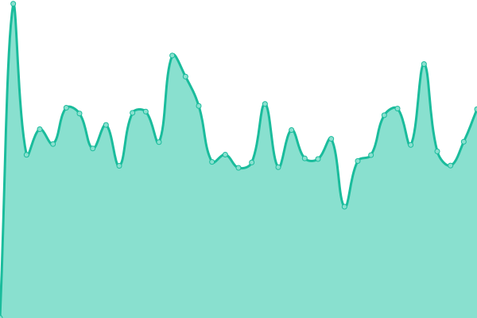
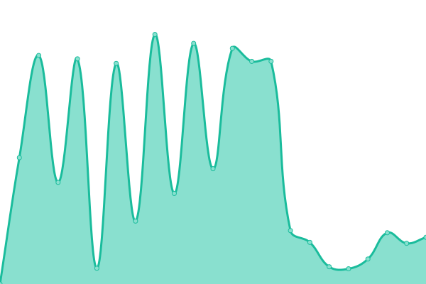

# [📈 Live Status](https://upptime.github.io/upptime): <!--live status--> **🟩 All systems operational**

This repository contains the open-source uptime monitor and status page for [Upptime](https://upptime.js.org), powered by [Upptime](https://github.com/upptime/upptime).

With [Upptime](https://upptime.js.org), you can get your own unlimited and free uptime monitor and status page, powered entirely by a GitHub repository. We use [Issues](https://github.com/upptime/upptime/issues) as incident reports, [Actions](https://github.com/i-Buildings/setzer-uptime/actions) as uptime monitors, and [Pages](https://upptime.github.io/upptime) for the status page.

<!--start: status pages-->
<!-- This summary is generated by Upptime (https://github.com/upptime/upptime) -->
<!-- Do not edit this manually, your changes will be overwritten -->
<!-- prettier-ignore -->
| URL | Status | History | Response Time | Uptime |
| --- | ------ | ------- | ------------- | ------ |
|  [MS Wolpertshausen](https://dns.loxonecloud.com/504F94D06D2C) | 🟩 Up | [ms-wolpertshausen.yml](https://github.com/i-Buildings/setzer-uptime/commits/HEAD/history/ms-wolpertshausen.yml) | 

 2205ms
     
 | 

<a href="https://i-Buildings.github.io/setzer-uptime/history/ms-wolpertshausen">99.66%</a>
    

|  [MS Vellberg](https://dns.loxonecloud.com/504F94A1427B) | 🟩 Up | [ms-vellberg.yml](https://github.com/i-Buildings/setzer-uptime/commits/HEAD/history/ms-vellberg.yml) | 

 1562ms
     
 | 

<a href="https://i-Buildings.github.io/setzer-uptime/history/ms-vellberg">99.72%</a>
    

|  [MS Gründelhardt](https://dns.loxonecloud.com/504F94D00DAC) | 🟩 Up | [ms-gruendelhardt.yml](https://github.com/i-Buildings/setzer-uptime/commits/HEAD/history/ms-gruendelhardt.yml) | 

 6130ms
     
 | 

<a href="https://i-Buildings.github.io/setzer-uptime/history/ms-gruendelhardt">98.12%</a>
    

<!--end: status pages-->

[**Visit our status website →**](https://upptime.github.io/upptime)

## 📄 License

- Powered by: [Upptime](https://github.com/upptime/upptime)
- Code: [MIT](./LICENSE) © [Anand Chowdhary](https://anandchowdhary.com), supported by [Pabio](https://pabio.com)
- Data in the `./history` directory: [Open Database License](https://opendatacommons.org/licenses/odbl/1-0/)
